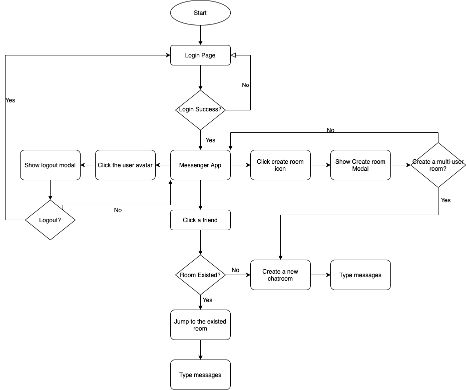
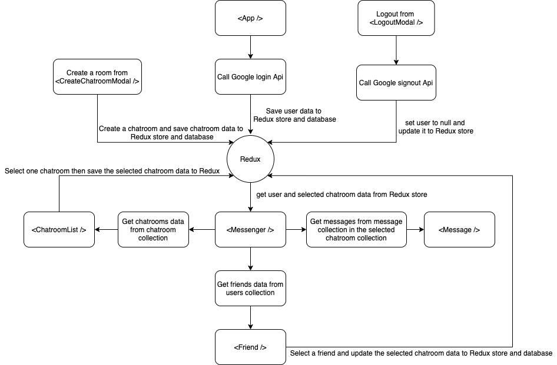

# React Cognite Chat App
### Demo Site: https://react-chat-app-79254.web.app/

## Development
```bash
$ yarn
$ yarn start
# Listening at http://localhost:3000 with the default
```

## Production
```bash
$ yarn build
# All files were built in the `build` folder
```

## Styleguidist
>Styleguidist will help you explore the usage of shared components
```bash
$ yarn run styleguide
# Listening at http://localhost:6060 with the default
```

## Flow Chart


## Data Flow Diagram


## Set up list


- [x] styling
  - [x] normalize.css
  - [x] styled-components
- [x] prettier
- [x] redux
  - [x] redux-toolkit
- [x] testing
  - [x] react-testing-library
  - [x] testing-library/jest-dom/extend-expect
  - [x] setupTest.js settings
  - [x] jest-styled-components
- [x] CI
  - [x] Firebase build-deploy yml setting


## Improvement

- Lazy loading messagese in chatrooms
- Add an API middleware layer between database and client-side to make the codebase cleaner
- Add theme changing feature